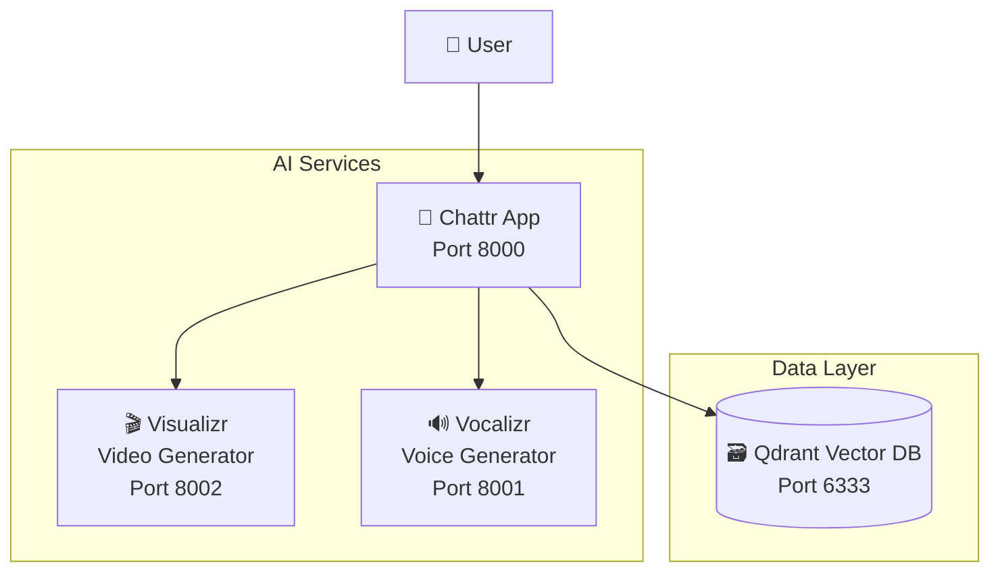

# Chatacter Backend

> **AI-Powered Character Chat System with Video and Voice Generation**

[](https://www.codefactor.io/repository/github/alphaspheredotai/chatacter_backend/overview/main)
[](./compose.yaml)
[](./docs/)

The Chatacter Backend is a sophisticated multi-service architecture that enables AI-powered character interactions with integrated video and voice generation capabilities. Built with modern containerization and microservices principles, it provides a scalable and extensible platform for creating immersive character-based chat experiences.

## 🚀 Quick Start

Get up and running in minutes:

```bash
# Clone with submodules
git clone --recurse-submodules https://github.com/AlphaSphereDotAI/chatacter_backend.git
cd chatacter_backend

# Set required environment variables
export MODEL__API_KEY="your-api-key-here"

# Launch all services
docker compose up -d
```

**Access Points:**
- 🤖 **Main Chat App**: http://localhost:8000
- 🎬 **Video Generator**: http://localhost:8002  
- 🔊 **Voice Generator**: http://localhost:8001
- 🗃️ **Vector Database**: http://localhost:6333

## 🏗️ Architecture Overview

The Chatacter Backend consists of four main components working together:



### Core Services

| Service | Purpose | Technology | Port |
|---------|---------|------------|------|
| **Chattr** | Main chat application with AI character interaction | Python, Gradio | 8000 |
| **Visualizr** | Video generation and visual content creation | Python, AI Models | 8002 |
| **Vocalizr** | Voice synthesis and audio generation | Python, TTS Models | 8001 |
| **Qdrant** | Vector database for semantic search and memory | Rust, Vector DB | 6333 |

## 📋 Prerequisites

- **Docker** (20.10+ recommended)
- **Docker Compose** (2.0+ recommended)
- **NVIDIA GPU** (for video/voice generation)
- **API Key** for AI model access (Groq, OpenAI, etc.)

## 🔧 Configuration

The system is configured via environment variables. Key settings:

```bash
# Required
MODEL__API_KEY=your-groq-or-openai-api-key

# Optional (with defaults)
MODEL__URL=https://api.groq.com/openai/v1
MODEL__NAME=llama3-70b-8192
MODEL__TEMPERATURE=0.0
```

[📖 Complete Configuration Reference](./docs/environment-variables.md)

## 🛠️ Development

For development setup and contributing:

```bash
# Development mode with hot reload
docker compose -f compose.yaml -f compose.dev.yaml up

# Run tests
docker compose exec app python -m pytest

# View logs
docker compose logs -f app
```

[📖 Development Guide](./docs/development.md) • [📖 Contributing](./docs/contributing.md)

## 📚 Documentation

Comprehensive documentation is available in the [`docs/`](./docs/) directory:

- **[📖 Complete Documentation](./docs/README.md)** - Full documentation index
- **[⚡ Quick Start Guide](./docs/quick-start.md)** - Detailed setup instructions  
- **[🏗️ Architecture Guide](./docs/architecture.md)** - System design and components
- **[🔌 API Reference](./docs/api/)** - Complete API documentation
- **[🚀 Deployment Guide](./docs/deployment.md)** - Production deployment
- **[🔧 Troubleshooting](./docs/troubleshooting.md)** - Common issues and solutions

## 🤝 Related Projects

- **[Chatacter](https://github.com/AlphaSphereDotAI/chatacter)** - Main project repository
- **[Chattr](https://github.com/AlphaSphereDotAI/chattr)** - Chat application component
- **[Visualizr](https://github.com/AlphaSphereDotAI/visualizr)** - Video generation service
- **[Vocalizr](https://github.com/AlphaSphereDotAI/vocalizr)** - Voice generation service

## 📄 License

This project is licensed under the terms specified in each component repository.

## 🆘 Support

- **Issues**: [GitHub Issues](https://github.com/AlphaSphereDotAI/chatacter_backend/issues)
- **Documentation**: [docs/](./docs/)
- **Troubleshooting**: [docs/troubleshooting.md](./docs/troubleshooting.md)
