# System Architecture

The Chatacter Backend is designed as a modern microservices architecture that provides scalable, AI-powered character interactions with multimedia generation capabilities.

## Overview

The system follows a service-oriented architecture (SOA) pattern with containerized services that communicate through well-defined APIs. Each service is independently deployable and scalable.

## Architecture Diagram

```mermaid
graph TB
    subgraph "Client Layer"
        Web[Web Browser]
        Mobile[Mobile App]
        API[API Clients]
    end
    
    subgraph "Load Balancer"
        LB[Load Balancer / Reverse Proxy]
    end
    
    subgraph "Application Layer"
        subgraph "Core Services"
            App[🤖 Chattr<br/>Main Application<br/>Port 8000]
        end
        
        subgraph "AI Services"
            Video[🎬 Visualizr<br/>Video Generator<br/>Port 8002]
            Voice[🔊 Vocalizr<br/>Voice Generator<br/>Port 8001]
        end
        
        subgraph "External AI"
            LLM[🧠 LLM API<br/>Groq/OpenAI]
        end
    end
    
    subgraph "Data Layer"
        VectorDB[(🗃️ Qdrant<br/>Vector Database<br/>Port 6333)]
        Memory[(🔄 Redis<br/>Short-term Memory)]
        Storage[📁 File Storage<br/>Assets/Media]
    end
    
    Web --> LB
    Mobile --> LB
    API --> LB
    LB --> App
    
    App --> VectorDB
    App --> Memory
    App --> Storage
    App --> Video
    App --> Voice
    App --> LLM
    
    Video --> Storage
    Voice --> Storage
```

## Service Components

### 1. Chattr (Main Application)
**Repository**: [chattr](https://github.com/AlphaSphereDotAI/chattr)

- **Purpose**: Core chat application and orchestration layer
- **Technology**: Python, Gradio, FastAPI
- **Responsibilities**:
  - User interface and session management
  - Character personality and context management
  - LLM integration and conversation flow
  - Service orchestration (video/voice generation)
  - Vector database operations for memory and retrieval

**Key Features**:
- 🤖 AI character interactions
- 💾 Conversation memory and context
- 🔍 Semantic search and retrieval
- 🎭 Multiple character personalities
- 📝 Chat history and session management

### 2. Visualizr (Video Generator)
**Repository**: [visualizr](https://github.com/AlphaSphereDotAI/visualizr)

- **Purpose**: AI-powered video generation and visual content creation
- **Technology**: Python, Computer Vision models, GPU acceleration
- **Responsibilities**:
  - Video generation from text descriptions
  - Character animation and movement
  - Scene composition and rendering
  - Video processing and optimization

**Key Features**:
- 🎬 Text-to-video generation
- 🎭 Character animation
- 🎨 Style customization
- ⚡ GPU-accelerated processing

### 3. Vocalizr (Voice Generator)
**Repository**: [vocalizr](https://github.com/AlphaSphereDotAI/vocalizr)

- **Purpose**: Voice synthesis and audio generation
- **Technology**: Python, TTS models, Audio processing
- **Responsibilities**:
  - Text-to-speech conversion
  - Voice cloning and character voices
  - Audio processing and effects
  - Real-time voice generation

**Key Features**:
- 🔊 Text-to-speech synthesis
- 🎵 Multiple voice models
- 🔄 Real-time generation
- 🎚️ Audio quality optimization

### 4. Qdrant (Vector Database)
**Repository**: [Qdrant](https://github.com/qdrant/qdrant)

- **Purpose**: Vector storage and semantic search
- **Technology**: Rust, Vector similarity search
- **Responsibilities**:
  - Conversation embeddings storage
  - Semantic search for context retrieval
  - Character memory persistence
  - Knowledge base storage

**Key Features**:
- 🔍 High-performance vector search
- 📊 Multiple distance metrics
- 🔄 Real-time indexing
- 📈 Horizontal scaling

## Communication Patterns

### 1. Synchronous Communication
- **HTTP/REST APIs**: Direct service-to-service calls
- **WebSocket**: Real-time user interactions
- **gRPC**: High-performance inter-service communication

### 2. Asynchronous Communication
- **Message Queues**: Background processing tasks
- **Event Streaming**: Real-time updates and notifications
- **Webhooks**: External service integrations

### 3. Data Flow

## Scalability Considerations

### Horizontal Scaling
- **Service Replication**: Multiple instances per service
- **Load Balancing**: Distribute traffic across instances
- **Database Sharding**: Partition data across multiple databases

### Vertical Scaling
- **GPU Resources**: Scale video/voice services with more powerful GPUs
- **Memory**: Increase RAM for better vector operations
- **CPU**: More cores for parallel processing

### Caching Strategy
- **Application Cache**: In-memory response caching
- **CDN**: Static asset distribution
- **Database Cache**: Query result caching

## Security Architecture

### 1. Authentication & Authorization
- API key management for external services
- Service-to-service authentication
- Rate limiting and throttling

### 2. Data Protection
- Encryption at rest and in transit
- Secure secret management
- Data privacy compliance

### 3. Network Security
- Container network isolation
- Firewall rules and port restrictions
- TLS/SSL encryption

## Monitoring & Observability

### 1. Metrics Collection
- **Application Metrics**: Response times, error rates
- **Infrastructure Metrics**: CPU, memory, GPU usage
- **Business Metrics**: User interactions, generation counts

### 2. Logging Strategy
- **Structured Logging**: JSON format for easy parsing
- **Centralized Logs**: Aggregated log collection
- **Log Retention**: Configurable retention policies

### 3. Distributed Tracing
- **Request Tracing**: Track requests across services
- **Performance Monitoring**: Identify bottlenecks
- **Error Tracking**: Root cause analysis

## Technology Stack

| Layer | Technologies |
|-------|-------------|
| **Frontend** | Gradio UI, HTML/CSS/JavaScript |
| **Backend** | Python, FastAPI, Gradio |
| **AI/ML** | PyTorch, Transformers, Diffusion Models |
| **Database** | Qdrant (Vector), Redis (Cache) |
| **Message Queue** | Redis/RabbitMQ |
| **Containerization** | Docker, Docker Compose |
| **Orchestration** | Docker Swarm, Kubernetes (optional) |
| **Monitoring** | Prometheus, Grafana |
| **Logging** | ELK Stack (Elasticsearch, Logstash, Kibana) |

## Design Principles

### 1. Microservices
- **Single Responsibility**: Each service has one clear purpose
- **Independence**: Services can be developed and deployed independently
- **Technology Diversity**: Best tool for each job

### 2. Containerization
- **Consistency**: Same environment across dev/staging/prod
- **Isolation**: Services run in isolated containers
- **Portability**: Easy deployment across platforms

### 3. API-First Design
- **Contract-Driven**: APIs defined before implementation
- **Versioning**: Backward-compatible API evolution
- **Documentation**: Comprehensive API documentation

### 4. Cloud-Native
- **Stateless Services**: Enable horizontal scaling
- **Configuration**: Environment-based configuration
- **Health Checks**: Service health monitoring

## Future Considerations

### Short-term Improvements
- [ ] Add API rate limiting
- [ ] Implement health check endpoints
- [ ] Add metrics collection
- [ ] Improve error handling

### Long-term Evolution
- [ ] Kubernetes deployment
- [ ] Multi-region deployment
- [ ] Advanced AI model integration
- [ ] Real-time collaboration features

---

This architecture provides a solid foundation for building scalable, maintainable, and extensible AI-powered character interaction systems.