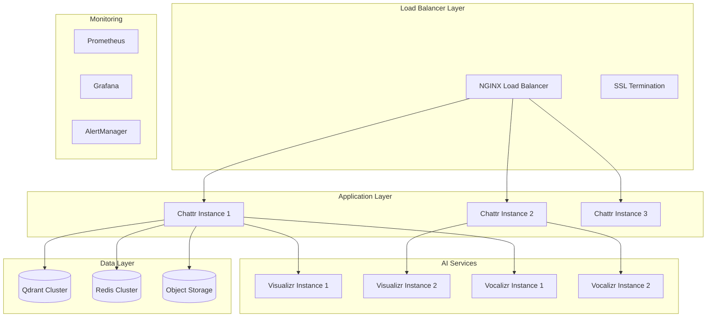

# Production Deployment Guide

This guide covers deploying the Chatacter Backend system to production environments, including cloud platforms, on-premises servers, and container orchestration systems.

## Table of Contents

- [Deployment Overview](#deployment-overview)
- [Docker Compose Deployment](#docker-compose-deployment)
- [Cloud Platform Deployment](#cloud-platform-deployment)
- [Kubernetes Deployment](#kubernetes-deployment)
- [Security Configuration](#security-configuration)
- [Monitoring & Observability](#monitoring--observability)
- [Backup & Recovery](#backup--recovery)
- [Performance Optimization](#performance-optimization)

## Deployment Overview

### Infrastructure Requirements

#### Minimum Production Requirements
- **CPU**: 8+ cores (x86_64)
- **RAM**: 32GB minimum, 64GB recommended
- **Storage**: 500GB SSD for optimal performance
- **GPU**: NVIDIA GPU with 12GB+ VRAM (RTX 3080 Ti, A40, A100)
- **Network**: 1Gbps+ bandwidth
- **OS**: Ubuntu 22.04 LTS or similar Linux distribution

#### Recommended Production Setup
- **Load Balancer**: NGINX or cloud load balancer
- **Database**: Managed Qdrant Cloud or self-hosted cluster
- **Cache**: Redis cluster for session management
- **Storage**: S3-compatible object storage for media files
- **Monitoring**: Prometheus + Grafana + AlertManager

### Architecture for Production



## Docker Compose Deployment

### Production Docker Compose Setup

#### 1. Prepare Production Environment

```bash
# Create production directory
sudo mkdir -p /opt/chatacter-prod
cd /opt/chatacter-prod

# Clone repository
git clone --recurse-submodules https://github.com/AlphaSphereDotAI/chatacter_backend.git .

# Set ownership
sudo chown -R chatacter:chatacter /opt/chatacter-prod
```

#### 2. Production Configuration

```bash
# Create production environment file
cat > .env.prod << 'EOF'
# === Core Configuration ===
ENVIRONMENT=production
DEBUG=false
LOG_LEVEL=INFO

# === Model Configuration ===
MODEL__API_KEY=your-production-api-key
MODEL__URL=https://api.groq.com/openai/v1
MODEL__NAME=llama3-70b-8192
MODEL__TEMPERATURE=0.0

# === Database Configuration ===
VECTOR_DATABASE__URL=http://qdrant-cluster:6333
VECTOR_DATABASE__NAME=chatacter_prod
REDIS_URL=redis://redis-cluster:6379/0

# === Service URLs ===
VOICE_GENERATOR_MCP__URL=http://voice_generator:7860/gradio_api/mcp/sse
VIDEO_GENERATOR_MCP__URL=http://video_generator:7860/gradio_api/mcp/sse

# === Security ===
SECRET_KEY=your-super-secret-production-key-here
ALLOWED_HOSTS=yourdomain.com,www.yourdomain.com,api.yourdomain.com
CORS_ORIGINS=https://yourdomain.com,https://www.yourdomain.com

# === Performance ===
WORKERS=4
MAX_CONCURRENT_REQUESTS=100
CACHE_TTL=3600
PRELOAD_MODELS=true

# === Storage ===
ASSETS_PATH=/data/assets
LOGS_PATH=/data/logs
S3_BUCKET=chatacter-assets
S3_REGION=us-west-2

# === Monitoring ===
ENABLE_METRICS=true
METRICS_PORT=9090
SENTRY_DSN=your-sentry-dsn

# === Resource Limits ===
APP_MEMORY_LIMIT=8g
VIDEO_MEMORY_LIMIT=16g
VOICE_MEMORY_LIMIT=8g
EOF

# Secure the environment file
chmod 600 .env.prod
```

#### 3. Production Compose Configuration

```yaml
# compose.prod.yaml
version: '3.8'

services:
  nginx:
    image: nginx:alpine
    ports:
      - "80:80"
      - "443:443"
    volumes:
      - ./nginx/nginx.conf:/etc/nginx/nginx.conf:ro
      - ./nginx/ssl:/etc/nginx/ssl:ro
      - ./nginx/logs:/var/log/nginx
    depends_on:
      - app
    restart: unless-stopped
    networks:
      - chatacter-network

  app:
    image: ghcr.io/alphaspheredotai/chattr:latest
    deploy:
      replicas: 3
      resources:
        limits:
          memory: ${APP_MEMORY_LIMIT:-8g}
          cpus: '2.0'
        reservations:
          memory: 4g
          cpus: '1.0'
    environment:
      - ENVIRONMENT=production
    env_file:
      - .env.prod
    volumes:
      - app_data:/home/nonroot/assets
      - app_logs:/home/nonroot/logs
    restart: unless-stopped
    healthcheck:
      test: ["CMD", "curl", "-f", "http://localhost:7860/health"]
      interval: 30s
      timeout: 10s
      retries: 3
      start_period: 60s
    networks:
      - chatacter-network

  video_generator:
    image: ghcr.io/alphaspheredotai/visualizr:latest
    deploy:
      replicas: 2
      resources:
        limits:
          memory: ${VIDEO_MEMORY_LIMIT:-16g}
        reservations:
          devices:
            - driver: nvidia
              count: 1
              capabilities: [gpu]
    env_file:
      - .env.prod
    volumes:
      - video_data:/home/nonroot/assets
      - video_logs:/home/nonroot/logs
    restart: unless-stopped
    healthcheck:
      test: ["CMD", "curl", "-f", "http://localhost:7860/health"]
      interval: 60s
      timeout: 20s
      retries: 3
      start_period: 120s
    networks:
      - chatacter-network

  voice_generator:
    image: ghcr.io/alphaspheredotai/vocalizr:latest
    deploy:
      replicas: 2
      resources:
        limits:
          memory: ${VOICE_MEMORY_LIMIT:-8g}
        reservations:
          devices:
            - driver: nvidia
              count: 1
              capabilities: [gpu]
    env_file:
      - .env.prod
    volumes:
      - voice_data:/home/nonroot/assets
      - voice_logs:/home/nonroot/logs
    restart: unless-stopped
    networks:
      - chatacter-network

  qdrant:
    image: qdrant/qdrant:latest
    deploy:
      resources:
        limits:
          memory: 8g
          cpus: '4.0'
    volumes:
      - qdrant_data:/qdrant/storage
      - qdrant_config:/qdrant/config
    ports:
      - "6333:6333"
      - "6334:6334"
    restart: unless-stopped
    networks:
      - chatacter-network

  redis:
    image: redis:alpine
    command: redis-server --appendonly yes --maxmemory 2g --maxmemory-policy allkeys-lru
    volumes:
      - redis_data:/data
    restart: unless-stopped
    networks:
      - chatacter-network

  prometheus:
    image: prom/prometheus:latest
    ports:
      - "9090:9090"
    volumes:
      - ./monitoring/prometheus.yml:/etc/prometheus/prometheus.yml:ro
      - prometheus_data:/prometheus
    command:
      - '--config.file=/etc/prometheus/prometheus.yml'
      - '--storage.tsdb.path=/prometheus'
      - '--web.console.libraries=/etc/prometheus/console_libraries'
      - '--web.console.templates=/etc/prometheus/consoles'
      - '--storage.tsdb.retention.time=200h'
      - '--web.enable-lifecycle'
    restart: unless-stopped
    networks:
      - chatacter-network

  grafana:
    image: grafana/grafana:latest
    ports:
      - "3000:3000"
    volumes:
      - grafana_data:/var/lib/grafana
      - ./monitoring/grafana/dashboards:/etc/grafana/provisioning/dashboards:ro
      - ./monitoring/grafana/datasources:/etc/grafana/provisioning/datasources:ro
    environment:
      - GF_SECURITY_ADMIN_PASSWORD=admin_password_change_me
      - GF_INSTALL_PLUGINS=grafana-clock-panel,grafana-simple-json-datasource
    restart: unless-stopped
    networks:
      - chatacter-network

volumes:
  app_data:
  app_logs:
  video_data:
  video_logs:
  voice_data:
  voice_logs:
  qdrant_data:
  qdrant_config:
  redis_data:
  prometheus_data:
  grafana_data:

networks:
  chatacter-network:
    driver: bridge
```

#### 4. NGINX Configuration

```nginx
# nginx/nginx.conf
events {
    worker_connections 1024;
}

http {
    upstream app_backend {
        least_conn;
        server app_1:7860 max_fails=3 fail_timeout=30s;
        server app_2:7860 max_fails=3 fail_timeout=30s;
        server app_3:7860 max_fails=3 fail_timeout=30s;
    }

    upstream video_backend {
        least_conn;
        server video_generator_1:7860;
        server video_generator_2:7860;
    }

    upstream voice_backend {
        least_conn;
        server voice_generator_1:7860;
        server voice_generator_2:7860;
    }

    # Rate limiting
    limit_req_zone $binary_remote_addr zone=api:10m rate=10r/s;
    limit_req_zone $binary_remote_addr zone=media:10m rate=1r/s;

    # SSL configuration
    ssl_protocols TLSv1.2 TLSv1.3;
    ssl_ciphers ECDHE-RSA-AES256-GCM-SHA512:DHE-RSA-AES256-GCM-SHA512:ECDHE-RSA-AES256-GCM-SHA384:DHE-RSA-AES256-GCM-SHA384;
    ssl_prefer_server_ciphers off;
    ssl_session_cache shared:SSL:10m;

    # Security headers
    add_header X-Frame-Options DENY;
    add_header X-Content-Type-Options nosniff;
    add_header X-XSS-Protection "1; mode=block";
    add_header Strict-Transport-Security "max-age=63072000; includeSubDomains; preload";

    # Redirect HTTP to HTTPS
    server {
        listen 80;
        server_name yourdomain.com www.yourdomain.com;
        return 301 https://$server_name$request_uri;
    }

    # Main application
    server {
        listen 443 ssl http2;
        server_name yourdomain.com www.yourdomain.com;

        ssl_certificate /etc/nginx/ssl/fullchain.pem;
        ssl_certificate_key /etc/nginx/ssl/privkey.pem;

        # Main app
        location / {
            limit_req zone=api burst=20 nodelay;
            proxy_pass http://app_backend;
            proxy_set_header Host $host;
            proxy_set_header X-Real-IP $remote_addr;
            proxy_set_header X-Forwarded-For $proxy_add_x_forwarded_for;
            proxy_set_header X-Forwarded-Proto $scheme;
            proxy_read_timeout 300s;
            proxy_connect_timeout 75s;
        }

        # API endpoints
        location /api/ {
            limit_req zone=api burst=50 nodelay;
            proxy_pass http://app_backend;
            proxy_set_header Host $host;
            proxy_set_header X-Real-IP $remote_addr;
            proxy_set_header X-Forwarded-For $proxy_add_x_forwarded_for;
            proxy_set_header X-Forwarded-Proto $scheme;
        }

        # Video generation
        location /video/ {
            limit_req zone=media burst=5 nodelay;
            proxy_pass http://video_backend/;
            proxy_set_header Host $host;
            proxy_set_header X-Real-IP $remote_addr;
            proxy_read_timeout 600s;
            proxy_connect_timeout 75s;
        }

        # Voice generation
        location /voice/ {
            limit_req zone=media burst=10 nodelay;
            proxy_pass http://voice_backend/;
            proxy_set_header Host $host;
            proxy_set_header X-Real-IP $remote_addr;
            proxy_read_timeout 300s;
            proxy_connect_timeout 75s;
        }

        # Static assets
        location /assets/ {
            alias /data/assets/;
            expires 1y;
            add_header Cache-Control "public, immutable";
        }

        # Health checks
        location /health {
            access_log off;
            proxy_pass http://app_backend/health;
        }
    }

    # Monitoring
    server {
        listen 443 ssl http2;
        server_name monitoring.yourdomain.com;

        ssl_certificate /etc/nginx/ssl/fullchain.pem;
        ssl_certificate_key /etc/nginx/ssl/privkey.pem;

        # Basic auth for monitoring
        auth_basic "Monitoring Access";
        auth_basic_user_file /etc/nginx/.htpasswd;

        location /grafana/ {
            proxy_pass http://grafana:3000/;
            proxy_set_header Host $host;
            proxy_set_header X-Real-IP $remote_addr;
        }

        location /prometheus/ {
            proxy_pass http://prometheus:9090/;
            proxy_set_header Host $host;
            proxy_set_header X-Real-IP $remote_addr;
        }
    }
}
```

#### 5. SSL Certificate Setup

```bash
# Using Let's Encrypt with Certbot
sudo apt install certbot python3-certbot-nginx

# Generate certificates
sudo certbot certonly --nginx -d yourdomain.com -d www.yourdomain.com

# Copy certificates to nginx directory
mkdir -p nginx/ssl
sudo cp /etc/letsencrypt/live/yourdomain.com/fullchain.pem nginx/ssl/
sudo cp /etc/letsencrypt/live/yourdomain.com/privkey.pem nginx/ssl/
sudo chown -R $USER:$USER nginx/ssl/

# Set up auto-renewal
sudo crontab -e
# Add: 0 2 * * * certbot renew --quiet && docker compose restart nginx
```

#### 6. Deploy to Production

```bash
# Build and deploy
docker compose -f compose.yaml -f compose.prod.yaml up -d

# Verify deployment
docker compose ps
docker compose logs -f

# Test health endpoints
curl -k https://yourdomain.com/health
```

## Cloud Platform Deployment

### AWS Deployment

#### Using AWS ECS

```bash
# Install AWS CLI and ECS CLI
pip install awscli
curl -o ecs-cli https://amazon-ecs-cli.s3.amazonaws.com/ecs-cli-linux-amd64-latest
chmod +x ecs-cli && sudo mv ecs-cli /usr/local/bin/

# Configure ECS
ecs-cli configure --cluster chatacter-prod --region us-west-2

# Create ECS cluster
ecs-cli up --capability-iam --size 3 --instance-type g4dn.2xlarge

# Deploy services
ecs-cli compose -f compose.yaml -f compose.aws.yaml up
```

**ECS Task Definition Example:**
```json
{
  "family": "chatacter-app",
  "networkMode": "awsvpc",
  "requiresCompatibilities": ["EC2"],
  "cpu": "2048",
  "memory": "8192",
  "taskRoleArn": "arn:aws:iam::account:role/ecsTaskRole",
  "containerDefinitions": [
    {
      "name": "chattr",
      "image": "ghcr.io/alphaspheredotai/chattr:latest",
      "memory": 8192,
      "cpu": 2048,
      "essential": true,
      "portMappings": [
        {
          "containerPort": 7860,
          "protocol": "tcp"
        }
      ],
      "environment": [
        {
          "name": "MODEL__API_KEY",
          "value": "${MODEL_API_KEY}"
        }
      ],
      "logConfiguration": {
        "logDriver": "awslogs",
        "options": {
          "awslogs-group": "/ecs/chatacter-app",
          "awslogs-region": "us-west-2",
          "awslogs-stream-prefix": "ecs"
        }
      }
    }
  ]
}
```

#### Using AWS EKS

```bash
# Install eksctl
curl --silent --location "https://github.com/weaveworks/eksctl/releases/latest/download/eksctl_$(uname -s)_amd64.tar.gz" | tar xz -C /tmp
sudo mv /tmp/eksctl /usr/local/bin

# Create EKS cluster
eksctl create cluster \
  --name chatacter-prod \
  --region us-west-2 \
  --nodegroup-name gpu-nodes \
  --node-type g4dn.2xlarge \
  --nodes 3 \
  --nodes-min 1 \
  --nodes-max 5

# Deploy to EKS
kubectl apply -f k8s/
```

### Google Cloud Platform

#### Using Google Kubernetes Engine (GKE)

```bash
# Install gcloud CLI
curl https://sdk.cloud.google.com | bash

# Create GKE cluster with GPU support
gcloud container clusters create chatacter-prod \
  --machine-type=n1-standard-4 \
  --num-nodes=3 \
  --zone=us-west1-b \
  --accelerator type=nvidia-tesla-t4,count=1 \
  --enable-autoscaling \
  --min-nodes=1 \
  --max-nodes=10

# Install NVIDIA device plugin
kubectl apply -f https://raw.githubusercontent.com/GoogleCloudPlatform/container-engine-accelerators/master/nvidia-driver-installer/cos/daemonset-preloaded.yaml

# Deploy application
kubectl apply -f k8s/
```

### Azure Deployment

#### Using Azure Container Instances

```bash
# Install Azure CLI
curl -sL https://aka.ms/InstallAzureCLIDeb | sudo bash

# Create resource group
az group create --name chatacter-prod --location westus2

# Create container group with GPU
az container create \
  --resource-group chatacter-prod \
  --name chatacter-app \
  --image ghcr.io/alphaspheredotai/chattr:latest \
  --cpu 4 \
  --memory 16 \
  --gpu-count 1 \
  --gpu-sku V100 \
  --ports 7860 \
  --environment-variables MODEL__API_KEY=$MODEL_API_KEY
```

## Kubernetes Deployment

### Kubernetes Manifests

#### Namespace and ConfigMap

```yaml
# k8s/namespace.yaml
apiVersion: v1
kind: Namespace
metadata:
  name: chatacter
---
apiVersion: v1
kind: ConfigMap
metadata:
  name: chatacter-config
  namespace: chatacter
data:
  MODEL__URL: "https://api.groq.com/openai/v1"
  MODEL__NAME: "llama3-70b-8192"
  VECTOR_DATABASE__URL: "http://qdrant:6333"
  REDIS_URL: "redis://redis:6379"
  ENVIRONMENT: "production"
  LOG_LEVEL: "INFO"
```

#### Secrets

```yaml
# k8s/secrets.yaml
apiVersion: v1
kind: Secret
metadata:
  name: chatacter-secrets
  namespace: chatacter
type: Opaque
data:
  model-api-key: <base64-encoded-api-key>
  secret-key: <base64-encoded-secret-key>
```

#### Main Application Deployment

```yaml
# k8s/app-deployment.yaml
apiVersion: apps/v1
kind: Deployment
metadata:
  name: chattr-app
  namespace: chatacter
spec:
  replicas: 3
  selector:
    matchLabels:
      app: chattr-app
  template:
    metadata:
      labels:
        app: chattr-app
    spec:
      containers:
      - name: chattr
        image: ghcr.io/alphaspheredotai/chattr:latest
        ports:
        - containerPort: 7860
        env:
        - name: MODEL__API_KEY
          valueFrom:
            secretKeyRef:
              name: chatacter-secrets
              key: model-api-key
        envFrom:
        - configMapRef:
            name: chatacter-config
        resources:
          requests:
            memory: "4Gi"
            cpu: "1"
          limits:
            memory: "8Gi"
            cpu: "2"
        livenessProbe:
          httpGet:
            path: /health
            port: 7860
          initialDelaySeconds: 60
          periodSeconds: 30
        readinessProbe:
          httpGet:
            path: /health
            port: 7860
          initialDelaySeconds: 30
          periodSeconds: 10
---
apiVersion: v1
kind: Service
metadata:
  name: chattr-app
  namespace: chatacter
spec:
  selector:
    app: chattr-app
  ports:
  - port: 80
    targetPort: 7860
  type: ClusterIP
```

#### GPU Workloads

```yaml
# k8s/video-deployment.yaml
apiVersion: apps/v1
kind: Deployment
metadata:
  name: visualizr
  namespace: chatacter
spec:
  replicas: 2
  selector:
    matchLabels:
      app: visualizr
  template:
    metadata:
      labels:
        app: visualizr
    spec:
      containers:
      - name: visualizr
        image: ghcr.io/alphaspheredotai/visualizr:latest
        ports:
        - containerPort: 7860
        resources:
          requests:
            memory: "8Gi"
            cpu: "2"
            nvidia.com/gpu: 1
          limits:
            memory: "16Gi"
            cpu: "4"
            nvidia.com/gpu: 1
        envFrom:
        - configMapRef:
            name: chatacter-config
```

#### Ingress Configuration

```yaml
# k8s/ingress.yaml
apiVersion: networking.k8s.io/v1
kind: Ingress
metadata:
  name: chatacter-ingress
  namespace: chatacter
  annotations:
    kubernetes.io/ingress.class: "nginx"
    cert-manager.io/cluster-issuer: "letsencrypt-prod"
    nginx.ingress.kubernetes.io/rate-limit: "100"
    nginx.ingress.kubernetes.io/rate-limit-window: "1m"
spec:
  tls:
  - hosts:
    - yourdomain.com
    secretName: chatacter-tls
  rules:
  - host: yourdomain.com
    http:
      paths:
      - path: /
        pathType: Prefix
        backend:
          service:
            name: chattr-app
            port:
              number: 80
      - path: /video
        pathType: Prefix
        backend:
          service:
            name: visualizr
            port:
              number: 80
      - path: /voice
        pathType: Prefix
        backend:
          service:
            name: vocalizr
            port:
              number: 80
```

#### Horizontal Pod Autoscaling

```yaml
# k8s/hpa.yaml
apiVersion: autoscaling/v2
kind: HorizontalPodAutoscaler
metadata:
  name: chattr-app-hpa
  namespace: chatacter
spec:
  scaleTargetRef:
    apiVersion: apps/v1
    kind: Deployment
    name: chattr-app
  minReplicas: 3
  maxReplicas: 10
  metrics:
  - type: Resource
    resource:
      name: cpu
      target:
        type: Utilization
        averageUtilization: 70
  - type: Resource
    resource:
      name: memory
      target:
        type: Utilization
        averageUtilization: 80
```

### Deploy to Kubernetes

```bash
# Apply all manifests
kubectl apply -f k8s/

# Check deployment status
kubectl get pods -n chatacter
kubectl get services -n chatacter
kubectl get ingress -n chatacter

# Monitor deployments
kubectl rollout status deployment/chattr-app -n chatacter

# View logs
kubectl logs -f deployment/chattr-app -n chatacter
```

## Security Configuration

### Network Security

#### Firewall Rules

```bash
# UFW configuration (Ubuntu)
sudo ufw default deny incoming
sudo ufw default allow outgoing

# Allow SSH
sudo ufw allow ssh

# Allow HTTP/HTTPS
sudo ufw allow 80/tcp
sudo ufw allow 443/tcp

# Allow monitoring (restrict to VPN/internal only)
sudo ufw allow from 10.0.0.0/8 to any port 3000
sudo ufw allow from 10.0.0.0/8 to any port 9090

# Enable firewall
sudo ufw enable
```

#### VPN Access for Management

```bash
# Install WireGuard for secure management access
sudo apt install wireguard

# Generate keys
wg genkey | tee privatekey | wg pubkey > publickey

# Configure VPN server
cat > /etc/wireguard/wg0.conf << 'EOF'
[Interface]
PrivateKey = <server-private-key>
Address = 10.0.0.1/24
ListenPort = 51820

[Peer]
PublicKey = <client-public-key>
AllowedIPs = 10.0.0.2/32
EOF

# Start VPN
sudo systemctl enable wg-quick@wg0
sudo systemctl start wg-quick@wg0
```

### Application Security

#### Environment Variables Security

```bash
# Use Docker Secrets in production
echo "your-api-key" | docker secret create model_api_key -
echo "your-secret-key" | docker secret create app_secret_key -

# Update compose file to use secrets
cat >> compose.prod.yaml << 'EOF'
secrets:
  model_api_key:
    external: true
  app_secret_key:
    external: true

services:
  app:
    secrets:
      - model_api_key
      - app_secret_key
    environment:
      - MODEL__API_KEY_FILE=/run/secrets/model_api_key
      - SECRET_KEY_FILE=/run/secrets/app_secret_key
EOF
```

#### SSL/TLS Configuration

```nginx
# Strong SSL configuration
ssl_protocols TLSv1.2 TLSv1.3;
ssl_ciphers 'ECDHE-ECDSA-AES256-GCM-SHA384:ECDHE-RSA-AES256-GCM-SHA384:ECDHE-ECDSA-CHACHA20-POLY1305:ECDHE-RSA-CHACHA20-POLY1305:ECDHE-ECDSA-AES128-GCM-SHA256:ECDHE-RSA-AES128-GCM-SHA256';
ssl_prefer_server_ciphers off;
ssl_session_timeout 1d;
ssl_session_cache shared:SSL:50m;
ssl_stapling on;
ssl_stapling_verify on;

# HSTS
add_header Strict-Transport-Security "max-age=63072000" always;
```

## Monitoring & Observability

### Prometheus Configuration

```yaml
# monitoring/prometheus.yml
global:
  scrape_interval: 15s
  evaluation_interval: 15s

rule_files:
  - "alert_rules.yml"

alerting:
  alertmanagers:
    - static_configs:
        - targets:
          - alertmanager:9093

scrape_configs:
  - job_name: 'chatacter-app'
    static_configs:
      - targets: ['app:9090']
    metrics_path: '/metrics'
    scrape_interval: 30s

  - job_name: 'visualizr'
    static_configs:
      - targets: ['video_generator:9090']

  - job_name: 'vocalizr'
    static_configs:
      - targets: ['voice_generator:9090']

  - job_name: 'qdrant'
    static_configs:
      - targets: ['qdrant:6333']
    metrics_path: '/metrics'

  - job_name: 'redis'
    static_configs:
      - targets: ['redis_exporter:9121']

  - job_name: 'node-exporter'
    static_configs:
      - targets: ['node_exporter:9100']
```

### Alert Rules

```yaml
# monitoring/alert_rules.yml
groups:
- name: chatacter.rules
  rules:
  - alert: HighCPUUsage
    expr: rate(cpu_usage_seconds_total[5m]) > 0.8
    for: 5m
    labels:
      severity: warning
    annotations:
      summary: "High CPU usage detected"
      description: "CPU usage is above 80% for 5 minutes"

  - alert: HighMemoryUsage
    expr: memory_usage_bytes / memory_total_bytes > 0.9
    for: 5m
    labels:
      severity: critical
    annotations:
      summary: "High memory usage detected"
      description: "Memory usage is above 90% for 5 minutes"

  - alert: ServiceDown
    expr: up == 0
    for: 1m
    labels:
      severity: critical
    annotations:
      summary: "Service is down"
      description: "{{ $labels.instance }} of job {{ $labels.job }} has been down for more than 1 minute"

  - alert: GPUMemoryHigh
    expr: gpu_memory_used_bytes / gpu_memory_total_bytes > 0.9
    for: 5m
    labels:
      severity: warning
    annotations:
      summary: "GPU memory usage is high"
      description: "GPU memory usage is above 90% for 5 minutes"
```

### Grafana Dashboards

```json
// monitoring/grafana/dashboards/chatacter-overview.json
{
  "dashboard": {
    "title": "Chatacter Backend Overview",
    "panels": [
      {
        "title": "Request Rate",
        "type": "graph",
        "targets": [
          {
            "expr": "rate(http_requests_total[5m])",
            "legendFormat": "{{service}}"
          }
        ]
      },
      {
        "title": "Response Time",
        "type": "graph",
        "targets": [
          {
            "expr": "histogram_quantile(0.95, rate(http_request_duration_seconds_bucket[5m]))",
            "legendFormat": "95th percentile"
          }
        ]
      },
      {
        "title": "GPU Utilization",
        "type": "graph",
        "targets": [
          {
            "expr": "gpu_utilization_percent",
            "legendFormat": "GPU {{gpu_id}}"
          }
        ]
      }
    ]
  }
}
```

## Backup & Recovery

### Database Backup

```bash
#!/bin/bash
# backup-qdrant.sh

BACKUP_DIR="/backups/qdrant"
DATE=$(date +%Y%m%d_%H%M%S)
BACKUP_FILE="qdrant_backup_${DATE}.tar.gz"

# Create backup directory
mkdir -p $BACKUP_DIR

# Create Qdrant snapshot
curl -X POST "http://localhost:6333/collections/chatacter/snapshots"

# Wait for snapshot creation
sleep 10

# Download snapshot
SNAPSHOT_NAME=$(curl -s "http://localhost:6333/collections/chatacter/snapshots" | jq -r '.result[-1].name')
curl -o "${BACKUP_DIR}/${BACKUP_FILE}" "http://localhost:6333/collections/chatacter/snapshots/${SNAPSHOT_NAME}"

# Upload to S3
aws s3 cp "${BACKUP_DIR}/${BACKUP_FILE}" "s3://chatacter-backups/qdrant/"

# Clean up old backups (keep last 30 days)
find $BACKUP_DIR -name "qdrant_backup_*.tar.gz" -mtime +30 -delete

echo "Backup completed: ${BACKUP_FILE}"
```

### Application Data Backup

```bash
#!/bin/bash
# backup-assets.sh

ASSETS_DIR="/data/assets"
BACKUP_DIR="/backups/assets"
DATE=$(date +%Y%m%d_%H%M%S)

# Sync assets to backup location
rsync -av --delete $ASSETS_DIR/ $BACKUP_DIR/

# Create compressed archive
tar -czf "/backups/assets_${DATE}.tar.gz" -C $BACKUP_DIR .

# Upload to S3
aws s3 cp "/backups/assets_${DATE}.tar.gz" "s3://chatacter-backups/assets/"

# Clean up old backups
find /backups -name "assets_*.tar.gz" -mtime +7 -delete
```

### Automated Backup Schedule

```bash
# Add to crontab
crontab -e

# Backup Qdrant daily at 2 AM
0 2 * * * /opt/chatacter-prod/scripts/backup-qdrant.sh

# Backup assets daily at 3 AM
0 3 * * * /opt/chatacter-prod/scripts/backup-assets.sh

# Weekly full system backup
0 4 * * 0 /opt/chatacter-prod/scripts/backup-full.sh
```

### Recovery Procedures

```bash
#!/bin/bash
# restore-qdrant.sh

BACKUP_FILE=$1
if [ -z "$BACKUP_FILE" ]; then
    echo "Usage: $0 <backup_file>"
    exit 1
fi

# Stop Qdrant service
docker compose stop qdrant

# Download backup from S3 if needed
if [[ $BACKUP_FILE == s3://* ]]; then
    aws s3 cp "$BACKUP_FILE" ./qdrant_restore.tar.gz
    BACKUP_FILE="./qdrant_restore.tar.gz"
fi

# Restore Qdrant data
docker compose run --rm -v ./qdrant_restore.tar.gz:/backup.tar.gz qdrant \
    sh -c "cd /qdrant/storage && tar -xzf /backup.tar.gz"

# Start Qdrant service
docker compose start qdrant

echo "Qdrant restore completed from: $BACKUP_FILE"
```

## Performance Optimization

### Resource Allocation

```yaml
# Optimized resource allocation
services:
  app:
    deploy:
      resources:
        limits:
          memory: 8g
          cpus: '4.0'
        reservations:
          memory: 4g
          cpus: '2.0'
    environment:
      - WORKERS=4
      - MAX_CONCURRENT_REQUESTS=50

  video_generator:
    deploy:
      resources:
        limits:
          memory: 16g
          cpus: '8.0'
        reservations:
          memory: 8g
          cpus: '4.0'
          devices:
            - driver: nvidia
              count: 1
              capabilities: [gpu]
```

### Caching Strategy

```bash
# Redis caching configuration
cat > redis.conf << 'EOF'
# Memory optimization
maxmemory 4gb
maxmemory-policy allkeys-lru

# Persistence
save 900 1
save 300 10
save 60 10000

# Performance
tcp-keepalive 300
timeout 0
EOF
```

### Load Balancing Configuration

```nginx
# Advanced load balancing
upstream app_backend {
    least_conn;
    server app1:7860 weight=3 max_fails=2 fail_timeout=30s;
    server app2:7860 weight=3 max_fails=2 fail_timeout=30s;
    server app3:7860 weight=2 max_fails=2 fail_timeout=30s backup;
    
    # Health check
    keepalive 32;
}

# Connection limits
limit_conn_zone $binary_remote_addr zone=perip:10m;
limit_conn_zone $server_name zone=perserver:10m;

server {
    # Rate limiting
    limit_req zone=api burst=50 nodelay;
    limit_conn perip 20;
    limit_conn perserver 1000;
    
    # Buffering
    proxy_buffering on;
    proxy_buffer_size 128k;
    proxy_buffers 4 256k;
    proxy_busy_buffers_size 256k;
    
    # Compression
    gzip on;
    gzip_vary on;
    gzip_min_length 1024;
    gzip_comp_level 6;
    gzip_types
        text/plain
        text/css
        text/xml
        text/javascript
        application/json
        application/javascript
        application/xml+rss
        image/svg+xml;
}
```

---

This production deployment guide provides comprehensive coverage for deploying the Chatacter Backend system at scale. For specific environments or additional requirements, consult the individual service documentation and consider engaging with professional DevOps services for complex deployments.